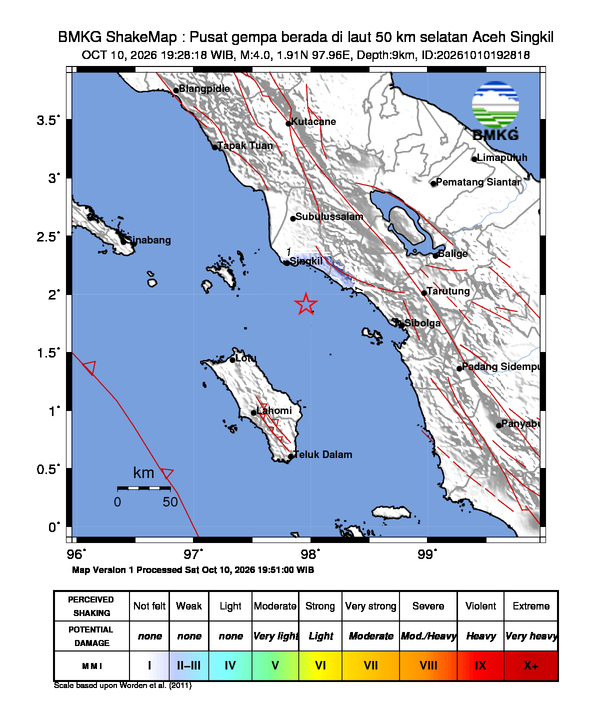

# 🌍 AutoGempa — Informasi Gempa Terkini Indonesia

> Monitor gempa bumi real-time untuk wilayah Indonesia. Data diambil otomatis dari **BMKG** setiap 5 menit oleh GitHub Actions, lalu ditampilkan lengkap di README ini beserta peta guncangannya (shakemap).

🕒 **Update otomatis terakhir:** Rabu, 30 September 2026 pukul 12.43.16

---

## 🚨 Gempa Terkini

| Parameter | Detail |
| --- | --- |
| 📊 **Magnitudo** | M 4.1 |
| 📍 **Wilayah** | Pusat gempa berada di laut 54 km barat laut Calang-Aceh Jaya |
| 🕒 **Waktu** | 30 Sep 2026, 09:35:54 WIB |
| 🧭 **Koordinat** | 4.84,95.14 |
| 📏 **Kedalaman** | 5 km |
| 🌊 **Potensi** | Gempa ini dirasakan untuk diteruskan pada masyarakat |
| 📡 **Dirasakan** | III-IV Calang, III Aceh Besar, III Banda Aceh, II Sigli |
| 🔗 **Sumber** | [BMKG — InfoGempa Realtime](https://www.bmkg.go.id/gempabumi) |

### 🗺️ Peta Guncangan (Shakemap)

---

## 📜 Riwayat 15 Gempa Terakhir

| Waktu | Magnitudo | Wilayah | Kedalaman | Potensi |
| --- | --- | --- | --- | --- |
| 30 Sep 2026 09:35:54 WIB | **M 4.1** | Pusat gempa berada di laut 54 km barat laut Calang-Aceh Jaya | 5 km | Gempa ini dirasakan untuk diteruskan pada masyarakat |
| 29 Sep 2026 21:39:13 WIB | **M 3.1** | Pusat gempa berada di darat 5 km Barat Kolaka | 3 km | Gempa ini dirasakan untuk diteruskan pada masyarakat |
| 28 Sep 2026 21:43:09 WIB | **M 4.5** | Pusat gempa berada di laut 127 km Barat Daya Kota Sabang | 10 km | Gempa ini dirasakan untuk diteruskan pada masyarakat |
| 28 Sep 2026 17:41:49 WIB | **M 4.2** | Pusat gempa berada di laut 60 km utara Ruteng, Manggarai | 6 km | Gempa ini dirasakan untuk diteruskan pada masyarakat |
| 28 Sep 2026 11:30:48 WIB | **M 4.5** | Pusat gempa berada di laut 57 km Utara Ruteng-Manggarai | 1 km | Gempa ini dirasakan untuk diteruskan pada masyarakat |
| 28 Sep 2026 00:54:05 WIB | **M 3.4** | Pusat gempa berada di darat 18 km barat Bener Meriah | 10 km | Gempa ini dirasakan untuk diteruskan pada masyarakat |
| 27 Sep 2026 18:29:00 WIB | **M 2.5** | Pusat gempa berada di darat 2.7 km timur laut Mamasa | 5 km | Gempa ini dirasakan untuk diteruskan pada masyarakat |
| 27 Sep 2026 02:37:02 WIB | **M 4.9** | Pusat gempa berada di laut 61 km utara Ruteng, Manggarai | 10 km | Gempa ini dirasakan untuk diteruskan pada masyarakat |
| 26 Sep 2026 02:39:29 WIB | **M 4.9** | Pusat gempa berada di laut 46 km utara Ruteng-Manggarai | 9 km | Gempa ini dirasakan untuk diteruskan pada masyarakat |
| 25 Sep 2026 20:47:30 WIB | **M 4.7** | Pusat gempa berada di laut 58 km barat daya Sumur | 10 km | Gempa ini dirasakan untuk diteruskan pada masyarakat |
| 25 Sep 2026 15:04:42 WIB | **M 2.4** | Pusat gempa berada di darat 10 km selatan Kab. Cianjur | 7 km | Gempa ini dirasakan untuk diteruskan pada masyarakat |
| 25 Sep 2026 04:01:35 WIB | **M 3.7** | Pusat gempa berada di darat 17 km Timur Jantho Aceh Besar | 7 km | Gempa ini dirasakan untuk diteruskan pada masyarakat |
| 24 Sep 2026 10:30:28 WIB | **M 4.6** | Pusat gempa berada di laut 57 km timur Kota Bima | 12 km | Gempa ini dirasakan untuk diteruskan pada masyarakat |
| 23 Sep 2026 19:16:56 WIB | **M 1.8** | Pusat gempa berada di darat 24 km barat daya Lembata | 12 km | Gempa ini dirasakan untuk diteruskan pada masyarakat |
| 23 Sep 2026 09:02:44 WIB | **M 4.7** | Pusat gempa berada di laut 48 km utara Ruteng-Manggarai | 9 km | Gempa ini dirasakan untuk diteruskan pada masyarakat |

---

## 🛠️ Cara Kerja Repository Ini

- Workflow `.github/workflows/bmkg.yml` berjalan otomatis setiap **5 menit**.
- `src/index.js` mengambil data dari `https://data.bmkg.go.id/DataMKG/TEWS/autogempa.json`.
- Jika terdeteksi gempa **baru**:
  - `README.md` di-generate ulang (info detail + shakemap),
  - gambar shakemap disimpan ke `assets/shakemap.jpg`,
  - riwayat disimpan di `data/history.json` (maksimal 15 gempa),
  - semua di-commit & push otomatis ke branch `main`.
- Notifikasi **Discord** tetap dikirim jika magnitudo ≥ `MIN_MAGNITUDE`.

---

Dibuat dengan ❤️ oleh [RusdiEneri](https://github.com/RusdiEneri) • Sumber data: [BMKG](https://www.bmkg.go.id/)

_README ini dibuat otomatis oleh GitHub Actions — jangan edit manual._

